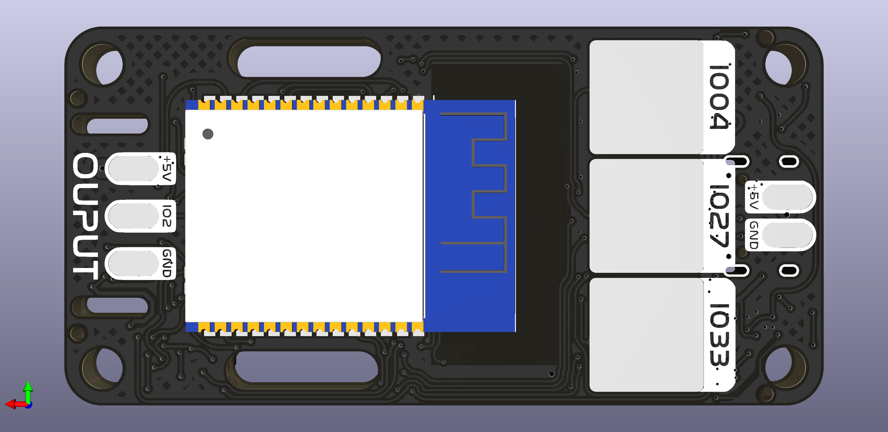
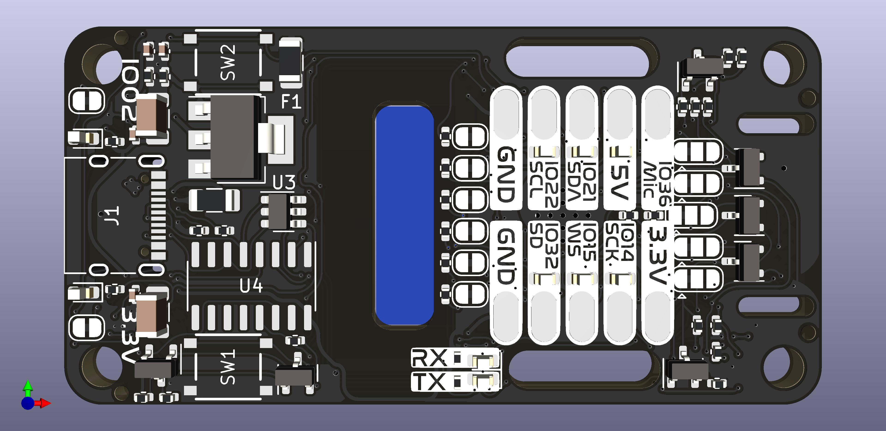

# KEX a Rapid Deployment ESP32 Board
A fast and feature-rich implementation of an ESP32 board with NeoPixel Led (WS2812B, WS2811, SK6812), I2S (Digital microphone) and I2C outputs.

## ⚙️ Features
- Supports USB C to USB C cables at 5V 3A 
- 3 Capacitive Touch Buttons
- Designed for PCB Assembly by JLCPCB 
- 3A Resettable Fuse on both the 3.3v and 5v Rails
- Programming using the CH340-c IC
- Electrostatic Discharge Protection on USB and LED Output
- Auto Reset for easy programming
- Solder Pad connections with Strain relief slots 
- High-Speed Bi-Directional Level shifted I2S and I2C ports using BSS138 like [Adafruit](https://www.adafruit.com/product/757)
- Cuttable solder pads to select between 3.3v and 5v level shifting
- LED indicators on all outputs and inputs
- Easy soldering of led strips directly to the PCB with Strain Releaf slots

## 📲 Quickstart for WLED
1. Solder the ESP32 to the footprint on the PCB

2. Connect up to 120 NeoPixels (WS2812B, WS2811, SK6812) to the output pads (IO2). 
3. Install the CH340 Drivers from [Sparkfun](https://learn.sparkfun.com/tutorials/how-to-install-ch340-drivers/all)
4. Flash the software to your ESP module! There are two options for this step:
  
&nbsp;&nbsp;&nbsp;&nbsp;&nbsp;&nbsp;[I just want to use WLED! (install release binary)](https://install.wled.me/)

&nbsp;&nbsp;&nbsp;&nbsp;&nbsp;&nbsp;[I want to modify WLED (compile from source code)](https://kno.wled.ge/advanced/compiling-wled/)

&nbsp;&nbsp;&nbsp;&nbsp;&nbsp;&nbsp;If set up correctly, the first thirty LEDs will light up!

5. Use a Computer/Phone to connect to the Wife named: WLED-AP using the password wled1234.

6. Click on the cog icon to edit settings like connecting the module to your home WiFi.
7. Upload Config File (Coming soon...)

## 💾 Pinout
Pin | IO2 | IO4 | IO14 | IO15 | IO21 | IO22 | IO27 | IO32 | IO33 | IO36
--- | --- | --- | --- |--- |--- |--- |--- |--- |--- |---
Usage | LED Output | Down Touch Pad | SCK | WS | SDA | SCL | Middle Touch Pad | SD |  Up Touch Pad | Analog Input 
LED | Yellow | | White | White | Red | Green | | White | | |
Level Shifted | | |✅|✅|✅|✅| |✅| 

## ✌️ Other

[Licensed under the MIT license](https://github.com/git/git-scm.com/blob/main/MIT-LICENSE.txt)

Designed by Chris Dirks (@CD_FER)

You can also send me emails to [cdirksfer@gmail.com](mailto:dev.cdirksfer@gmail.com), but please only do so if you want to talk to me privately.
